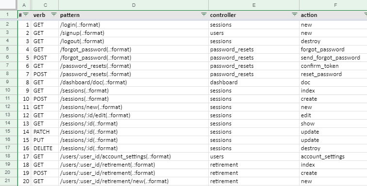

# 4.01.06 エントリーポイントの特定

## 概要

Webサイトを網羅的にテストするにはURL一覧が必要です。

## rails routes
rails では `rails routes` コマンドで route 一覧を出力できるので、これをURL一覧として使うことができます。
開発環境と本番環境とで routes が異なる場合があるので、`RAILS_ENV=production` オプションをつけて本番環境での routes を出力しましょう。

```
$ rails routes RAILS_ENV=production
Prefix Verb   URI Pattern                                                                              Controller#Action
 login GET    /login(.:format)                                                                         sessions#new
signup GET    /signup(.:format)                                                                        users#new
logout GET    /logout(.:format)                                                                        sessions#destroy
...
```

上記のように、`rails routes` はプレーンテキストで見やすいように整形して出力します。ただしこれはテストには使いづらいので、スプレッドシートで管理できるようTSV形式に変換します。
TSVに変換するスクリプトの例：

```ruby
# ~/sectest/routes_csv.rb
header = gets
li_prefix = header.index("Verb")
li_verb = header.index("URI Pattern")
li_pattern = header.index("Controller#Action")
print "#\tprefix\tverb\tpattern\tcontroller\taction\tnote1\tnote2\tnote3\n"
i = 1
prefix_current = ""
while line = gets
  prefix = line[0, li_prefix].strip
  prefix = prefix_current if prefix.length == 0
  prefix_current = prefix
  verb = line[li_prefix, li_verb - li_prefix].strip
  pattern = line[li_verb, li_pattern - li_verb].strip
  cont_and_action = line[li_pattern, line.length - li_pattern].strip
  controller = cont_and_action.split('#')[0]
  action = cont_and_action.split('#')[1]
  print "#{i}\t#{prefix}\t#{verb}\t#{pattern}\t#{controller}\t#{action}\n"
  i += 1
end
```

使い方

```
$ rails routes | ruby ~/sectest/routes_csv.rb > routes.tsv

$ cat routes.tsv
#       prefix  verb    pattern controller      action
1       login   GET     /login(.:format)        sessions        new
2       signup  GET     /signup(.:format)       users   new
...
```

作成されたTSVファイルをスプレッドシートにインポートするかコピペで貼り付ければURL一覧の出来上がりです。



## 注意点

一部のURLはrails routesで出力されない場合があります。例えばGrapeAPIのエンドポイントは出力されません。その場合、画面遷移図等のドキュメントやswagger などからURL一覧を補完する必要があります。