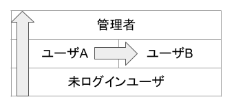

# 4.05.04 Bypassing Authorization Schema

## 概要

ログインしているユーザのロールや権限によって、使用できる機能やリソースを制限することがある。

このテストでは、機能やリソースへの認可が適切に制御されていて、ユーザの権限を超えた操作ができないようになっているかを検証します。

## 権限昇格

認可を破り、ユーザが持つ権限を超えた操作をすることを権限昇格と言います。権限昇格には2種類あり、縦(Vertical)の権限昇格と横(Horizontal)の権限昇格があります。

- 縦：より権限が強いロールの権限を奪取すること
- 横：同一のロールの中で、他のユーザの権限を奪取すること



## テストケースの作成

認可のルールはアプリケーションによって異なるため、テスターはアプリケーションの仕様に基づいてテストケースを作成する必要があります。

セキュリティテスターとして、認可のルールを正しく理解し検証するために、次の3つのステップを踏みます。

1. サブジェクト、オブジェクト、権限を洗い出す
2. アクセス制御マトリクスを作成する
3. マトリクスをRailsルーティングに適用する

なお、ここでは下記の認可仕様を持ったブログアプリケーションを例としてテストケースを作成します。

- 未ログインユーザは記事を参照できる
- ログインユーザは記事の参照と作成、自分の記事の変更と削除ができる
- 管理者はなんでもできる

### サブジェクト、オブジェクト、権限

認可とは、誰が、何を、どうできるか、を制御することです。それぞれを漏れなく列挙します。

- 誰が（サブジェクト, Subjects）
- 何を（オブジェクト, Objects）
- どうするか（権限, Rights）

ブログアプリケーションの例では次のようになります。

- サブジェクトは、`未ログインユーザ` `ログインユーザ` `管理者` です。
- オブジェクトは `記事` です。
- 権限は、記事の `作成` `参照` `編集` `削除` です。

### アクセス制御マトリクス

列挙したサブジェクト、オブジェクト、権限をマトリクスで表現しましょう。

|サブジェクト＼オブジェクト|記事|備考|
|:--|:--|:--|
|未ログインユーザ|参照||
|ログインユーザ|参照、\*作成、\*編集、\*削除|\*自分が作成した記事のみ|
|管理者|参照、作成、編集、削除||

`*` は横の権限昇格のテストが必要であることを示しています。横の権限をマトリクスで表現するには、サブジェクトとオブジェクトをユーザで分離します。

ここではログインユーザを `ユーザA` と `ユーザB`、記事を `ユーザAが作成した記事(記事A)` と `ユーザBが作成した記事(記事B)` に分けます。

|サブジェクト＼オブジェクト|記事A|記事B|
|:--|:--|:--|
|未ログインユーザ|参照|参照|
|ユーザA|参照、作成、編集、削除|参照|
|ユーザB|参照|参照、作成、編集、削除|
|管理者|参照、作成、編集、削除|参照、作成、編集、削除|

これでアプリケーションの認可仕様が明確になりました。

## 静的テスト

テストケースに基づいて、コントローラ・アクションに適切な認可が含まれていることを確認します。

本節では縦の権限昇格のみ扱います。横の権限昇格の静的テスト手法は [Insecure Direct Object Reference (IDOR)](04-04-Testing_for_Insecure_Direct_Object_References.md) を参照してください。

### 認可の実装パターン (deviseを使っている場合)

ログイン済みユーザだけが使える（ログインしないと使えない）

```ruby
class ArticlesController < ApplicationController
  before_action :authenticate_user!
```

ログインしなくても一部のアクションはでも使える

```ruby
class ArticlesController < ApplicationController
  before_action :authenticate_user!, only: [:show]
```

管理者だけが使える

```ruby
class ArticlesController < ApplicationController
  before_action :authenticate_user!
  before_action :check_admin

  def check_admin
      redirect_to root_path unless current_user.admin? 
  end
```

認可をアクションの中で定義

```ruby
class ArticlesController < ApplicationController
  before_action :authenticate_user!

  def update
    return head 403 unless current_user.admin? 
    # do something
  end
```

### 誤まってる可能性が高いパターン

作成や変更を制限する意図で new と edit に認証を付けている場合、create や update に直接リクエストを発行されてしまう可能性があります。

```ruby
class ArticlesController < ApplicationController
  before_action :authenticate_user!, only: [:new, :edit]
```

参照を禁止する意図で index と show を設定している場合、edit 画面から参照される可能性があります。

```ruby
class ArticlesController < ApplicationController
  before_action :authenticate_user!, only: [:index, :show]
```


## 動的テスト

### アクセス制御マトリクスを Rails ルーティングに当てはめる

作成したアクセス制御マトリクスでもテストは可能ですが、Rails のルーティングに適用するとより網羅性が高いテストケースにできます。

※ルーティングについては [4.01.06 エントリーポイントの特定](../01-Information_Gathering/06-Identify_Application_Entry_Points.md) を参照してください。

マトリクスを Rails ルーティングに当てはめると次のような表が完成します。

<!--
Rails の標準的な仕様において、権限とアクションの対応は下記となります。

|権限|アクション|
|:--|:--|
|作成|new, create|
|参照|index, show|
|変更|edit, update|
|削除|destroy|
-->

|権限|action|route|未ログイン|ユーザA|ユーザB|管理者|
|:--|:--|:--|:--|:--|:--|:--|
|作成|new|`GET /articles/new`||〇|〇|〇|
||create|`POST /articles`||〇|〇|〇|
|参照|show|`GET /articles/1`|〇|〇|〇|〇|
|||`GET /articles/2`|〇|〇|〇|〇|
|編集|edit|`GET /articles/1/edit`||〇||〇|
|||`GET /articles/2/edit`|||〇|〇|
||update|`PUT /articles/1`||〇||〇|
|||`PUT /articles/2`|||〇|〇|
|削除|destroy|`DELETE /articles/2`||〇||〇|
|||`DELETE /articles/2`|||〇|〇|

ルートの数 10 x ユーザの種類 4 = 40 のテストケースができました。この40パターンをテストし、想定通りの応答が帰ってくるかを確認します。

### GETのアクションのテスト：index, show, edit

TBW

### GET以外のアクションのテスト：create, update, destroy

※注意：GET以外のアクションを実行するとリソースが変更されたり破壊されたりする危険性があります。テスト実行の際は十分注意してください。

#### CSRFトークン検討

RailsではGET以外のアクション(POST, PUT, PATCH, DELETE)は既定でトークンによるCSRF対策が有効になっています。

そのため、Webブラウザを使わずにリクエストを送るにはCSRFトークンを付与する必要があります。

Rails ではセッション(Cookie)に紐づくCSRFトークンをHTMLの`<head>`の中に発行します。

```html
<html>
  <head>
    ...
    <meta name="csrf-param" content="authenticity_token" />
    <meta name="csrf-token" content="DFZR1rcR...【省略】...YwQsog==" />
```

このトークンをリクエストヘッダ `X-CSRF-TOKEN` に乗せればCSRFトークン検証を突破できます。

```http
POST /hoge HTTP/1.1
Host: 127.0.0.1
Cookie: _hogehoge_session=0123456789abcdef...
X-CSRF-TOKEN: DFZR1rcR...【省略】...YwQsog==
```