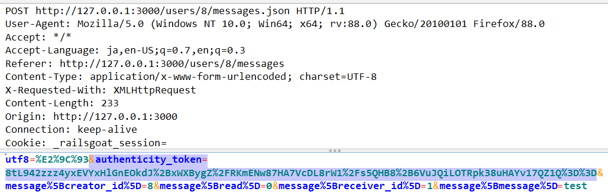
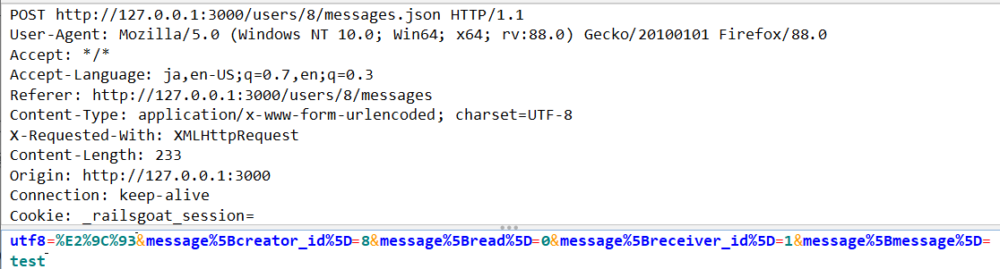

# 4.06.05 Cross Site Request Forgery (CSRF)

## 概要

Railsでは標準でCSRF攻撃の対策が実装されているため、正しく使っていればCSRFの脆弱性が作りこまれることはありません。

ただしCSRF対策機能を無効化していたり、RESTに沿わない実装をしている場合、CSRF攻撃に対して脆弱性になる場合があります。

このテストでは、RailsのCSRF対策機能が無効化されているような実装になっていないことを確認し、CSRF攻撃から保護されているかを検証します。

## 静的テスト

RailsにおいてCSRF攻撃に脆弱になるパターンは3つあります。

### CSRF対策機能を無効化している

`config/application.rb` に次の設定がある場合、CSRF対策機能が無効化されているため脆弱です。

```ruby
config.action_controller.allow_forgery_protection = false
```

### CSRFトークン検証を省略している

更新系のアクションでトークン検証を省略している場合、脆弱です。

```ruby
class HogeController < ApplicationController
  protect_from_forgery :except => [:index, :show, :update]
```

トークン検証の省略には、次のようなパターンもあります。

```ruby
class HogeController < ApplicationController
  skip_forgery_protection
```

```ruby
class HogeController < ApplicationController
  skip_before_action :verify_authenticity_token
```

### GETメソッドでリソースを変更している

GETメソッドのアクションでデータを作成、更新、削除をしている場合、CSRF攻撃に脆弱です。

```ruby
class HogeController < ApplicationController
  # GET /articles/:id/change_to_public
  def change_to_public
    @article = @current_user.articles.find(params[:id])
    @article.update(public: true)
```

## 動的テスト

RailsではCSRFトークンをリクエスト本文の authenticity_token か、リクエストヘッダの X-CSRF-TOKEN で送信します。

更新系のリクエストから authenticity_tokenとX-CSRF-TOKENを消してもリクエストが受理された場合、そのアクションはCSRF攻撃に脆弱です。

元のリクエスト


変更後のリクエスト
