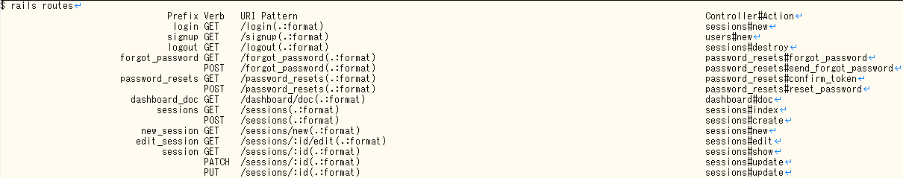
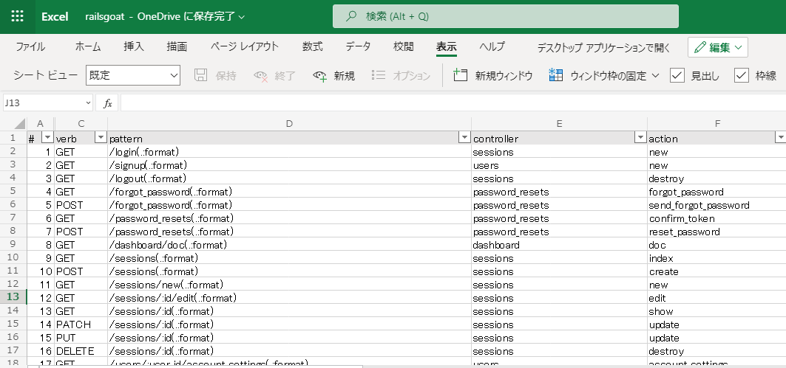

## セキュリティテストの準備

- `rails routes` コマンドの結果をもとにURL一覧を作る
- 開発ドキュメントなどテストに有用な情報をかき集める

## URL一覧の作成

URL一覧はセキュリティテストの必須アイテム。URLの数からおおよその工数見積もりができるとともに、進捗の把握もしやすくなる。

Rails には `rails routes` というルーティング一覧を出力してくれるコマンドがある。URLと対応するコントローラ、アクションも分かるため、ソースコードとWebブラウザの両方を眺めながらテストするのに非常に役立つ。

```shell
rails routes RAILS_ENV=production
```

rails環境の構築がめんどくさい場合は開発者からコマンドの実行結果をもらっても良いと思います。

コマンドの実行結果は下記のようなものです。

```
$ rails routes RAILS_ENV=production
                                Prefix Verb   URI Pattern                                                                              Controller#Action
                                 login GET    /login(.:format)                                                                         sessions#new
                                signup GET    /signup(.:format)                                                                        users#new
                                logout GET    /logout(.:format)                                                                        sessions#destroy
```

すごく、見づらいです。というのも、`rails routes` はプレーンテキストで見やすいように整形して出力するためです。



でもテストするには、プレーンテキストではなくスプレッドシートのほうが管理しやすいです。

これをテキスト処理をしてスプレッドシートに貼り付けるとこんな感じになります。



テキスト処理のスクリプトと使い方を張っておきます。

```ruby
# rails_routes_csv.rb
header = gets
li_prefix = header.index("Verb")
li_verb = header.index("URI Pattern")
li_pattern = header.index("Controller#Action")
print "#\tprefix\tverb\tpattern\tcontroller\taction\tnote1\tnote2\tnote3\n"
i = 1
prefix_current = ""
while line = gets
  prefix = line[0, li_prefix].strip
  prefix = prefix_current if prefix.length == 0
  prefix_current = prefix
  verb = line[li_prefix, li_verb - li_prefix].strip
  pattern = line[li_verb, li_pattern - li_verb].strip
  cont_and_action = line[li_pattern, line.length - li_pattern].strip
  controller = cont_and_action.split('#')[0]
  action = cont_and_action.split('#')[1]
  print "#{i}\t#{prefix}\t#{verb}\t#{pattern}\t#{controller}\t#{action}\n"
  i += 1
end
```

使い方

```cmd
$ rails routes | ruby ~/sectest/routes_csv.rb > routes.tsv

$ cat routes.tsv
#       prefix  verb    pattern controller      action
1       login   GET     /login(.:format)        sessions        new
2       signup  GET     /signup(.:format)       users   new
...
```

作成されたTSVファイルをスプレッドシートにインポートするかコピペで貼り付ければURL一覧の出来上がりです。

## 情報収集

事前に欲しい情報。
テストを始める前に、開発チームからもらったりドキュメントをあさったりしておく。すべてを揃える必要はないが、あればテストが捗る。

|必要なもの|項目|補足|
|:--|:--|:--|
|リポジトリ|URL|言わずもがな|
||ブランチ名|master?develop?確認しておこう|
||リビジョン|リビジョンを記録しておくと、次回のテスト時に差分比較がしやすくなる|
|ドキュメント|画面一覧|テスト漏れが無いように|
||画面遷移図|画面へのたどり着き方に迷わないように|
||権限一覧|アクセス制御のテストに必要|
||URL・パラメータ一覧|上で作りましたが、ドキュメントとしてあるなら参考になるはず|
||API仕様書|サンプルリクエストもあるとなおよい|
||インフラ構成図||
|テスト環境|URL|どの環境でテストするかを確認しておこう ※本番環境でテストするのはお勧めできない|
||認証情報|ログインID/パスワード、APIキーなど|
