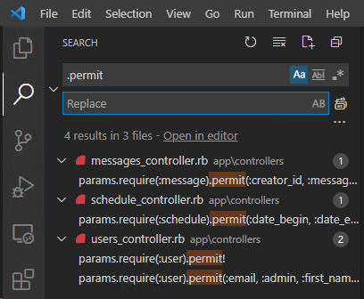
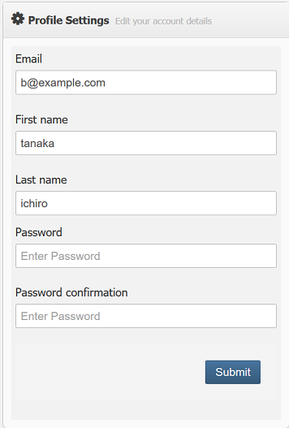
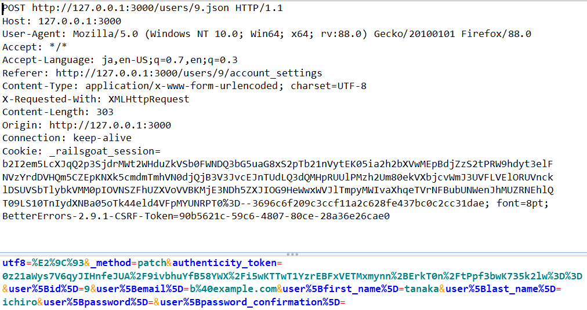
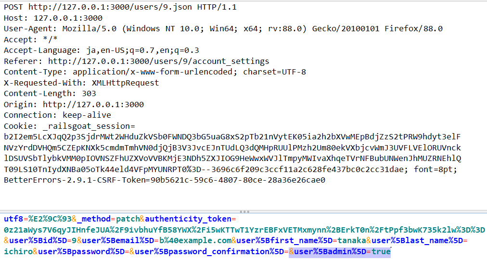

# 4.10.3 Test Integrity Checks

## 概要

Rails には Mass Assignment による不正なデータ改ざんを防ぐために、Strong Parameters という仕組みが導入されています。開発者は Strong Parameters を適切に使用することで、ユーザが変更可能な Active Model の属性を制限することができます。

しかし Strong Parameters の設定が不適切だと、依然としてデータ改ざんに対して脆弱な状態になってしまいます。

このテストでは Strong Parameters が適切に設定されていることを確認し、不正なデータ改ざんから保護されているかを検証します。

## 静的テスト

コントローラのソースコードで Strong Parameters を使用している箇所をレビューし、許可されている属性が最小限になっていることを確認します。

Strong Parameters を使用しているコードは `.permit` で検索すると見つけやすいでしょう。



### 脆弱なコードの例

全ての属性を許可：これは Mass Assignment を許可する危険な設定です。

```ruby
params.require(:user).permit!
```

不要なパラメータを許可

```ruby
params.require(:user).permit(:email, :admin, :first_name, :last_name)
```

### 安全なコードの例

必要最小限の属性のみ許可

```ruby
params.require(:user).permit(:email, :first_name, :last_name)
```

ユーザの権限によって許可する属性を切り替え

```ruby
params.require(:user).permit(:email, :first_name, :last_name, :admin) if user.admin
```
## 動的テスト

Create, Update リクエストのパラメータを書き換え、改ざんしたいパラメータを付与して送信します。

下図は Railsgoat の Account settings 画面 `http://127.0.0.1:3000/users/9/account_settings` です。



元のリクエスト



改ざん後のリクエスト

`&user%5Badmin%5D=true` を追加します。

