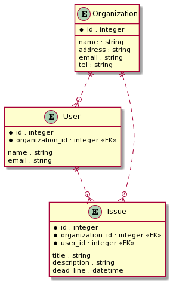
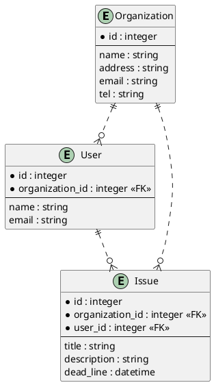
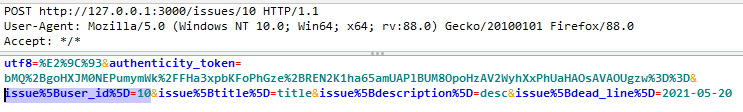
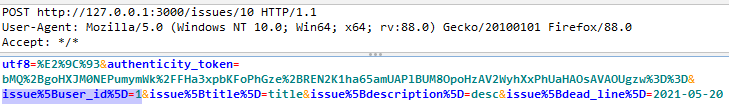

# 4.10.3 Test Integrity Checks - 外部キーの不正な更新

## 概要

あるレコードの外部キーの値を変更できる場合、権限を持たないリソースに関連付けできてしまう場合があります。これはデータの破壊や情報漏洩につながる可能性があります。

このテストでは、ユーザから入力された外部キーの値が検証され、不正なデータの関連付けから保護されていることを確認します。

## 脆弱性の原理

次のようなデータ構造を持ったSaaS型イシュー管理アプリケーションを考えます。

- ユーザ登録されると organization が1つ作成されます
- organization は、1人以上の user を持ちます
- organization は、0個以上の issue を持ちます
- issue には organization に所属する user を割り当てることができます



ユーザは issue の担当者を割り当てるために、issue の外部キーである user_id を変更することができます。

もしユーザが user_id を任意の値で更新できるとしたら、他の organization に所属している user に issue を割り当てることができてしまいます。これはデータの不整合を発生させるだけではなく、情報漏洩を引き起こす可能性もあります。

例えば次のようなコントローラとビューがある場合、他の organization に所属している user の名前やメールアドレスが参照できてしまいます。

```ruby
# app/controllers/issues_controller.rb
def index
    @issues = @organization.issues
end
```

```html
<!-- app/views/issues/index.html.erb -->
<tbody>
  <% @issues.each do |issue| %>
  <tr>
    <td><%= issue.title %></td>
    <td><%= issue.dead_line %></td>
    <td><%= issue.user.name %></td>
    <td><%= issue.user.email %></td>
  </tr>
  <% end %>
</tbody>
```


<!--
説明がくどすぎるので要推敲

## 脆弱性の原理

架空のイシュー管理SaaSを想定します。このSaaSは

- ユーザ登録されると organization が1つ作成されます。
- organization は、1人以上の user を持ちます
- organization は、0個以上の issue を持ちます
- issue には organization に所属する user を割り当てることができます

### ER図とデータ

<!--


organization

|id|name|
|:--|:--|
|1|Hogehoge, Ltd.|
|2|Foobar Inc.|

user

|id|name|email|organization_id|
|:--|:--|:--|:--|
|1|田中一郎|tanaka@hogehoge.example.com|1|
|2|佐藤次郎|sato@hogehoge.example.com|1|
|3|高橋春子|takahashi@foobar.example.com|2|
|4|鈴木太郎|suzuki@foobar.example.com|2|

issue

|id|name|dead_line|organization_id|user_id|
|:--|:--|:--|:--|:--|
|1|書類を作る|5/12|1|1|
|2|書類を送る|5/13|1|2|
|3|電話する|5/11|2|3|
|4|メール送る|5/11|2|4|

### Web画面

`Hogehoge, Ltd.` のイシュー一覧画面は次のように表示されます。

|ToDo|期限|担当者|担当者メールアドレス|
|:--|:--|:--|:--|
|書類を作る|5/12|田中一郎|tanaka@hogehoge.example.com|
|書類を送る|5/13|佐藤次郎|sato@hogehoge.example.com|

### 外部キー改ざんとその影響

issue に担当者を割り当てる次のようなアクションがあるとします。

```ruby
def assign_user
  @issue = @organization.find(params[:issue_id])
  @issue.update(user_id: params[:user_id])
```
-->

## 静的テスト

外部キーを更新しているコードとその周辺をレビューします。

もし外部キーが参照するリソースがアクセス制御を必要とする場合、更新しようとしている外部キーの値は、ユーザがアクセスできるリソースのID、であることを検証する必要があります。

SaaS型イシュー管理アプリケーションの場合、ユーザは他の organization に所属する user にアクセスできてはいけないため、issue 更新リクエストの user_id パラメータを検証する必要があります。

### 外部キーを更新するコードの例

update の属性に `xxx_id` がある

```ruby
issue.update(user_id: params[:user_id])
```

String Parameters の permit に `xxx_id` がある

```ruby
params.require(:issue).permit(:title, :description, :user_id)
```

### 外部キーを検証するコードの例

update が実行される前に、`user_id` パラメータが検証されているかを確認します。

検証がない場合、脆弱な可能性があります。

もし次のように `user_id` が検証されており、かつロジックの妥当性が確認できれば安全であると判断できます。

```ruby
unless @organization.users.exists?(id: params[:issue][:user_id])
  return head 403
end
```

※検証ロジックの有効性を確認するため、動的テストも実施することを推奨します

## 動的テスト

リソースの作成・更新リクエストを改ざんし、外部キー(`xxx_id`)の値を変更して送ります。

リクエストの例



`user_id` を改ざんしたリクエスト



外部キーの更新に成功した場合、脆弱であると判断します。