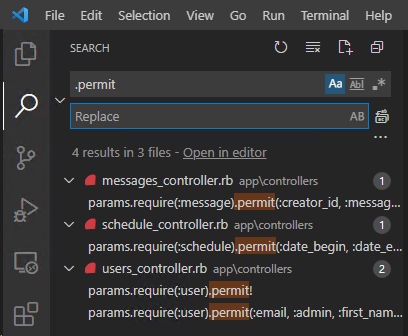
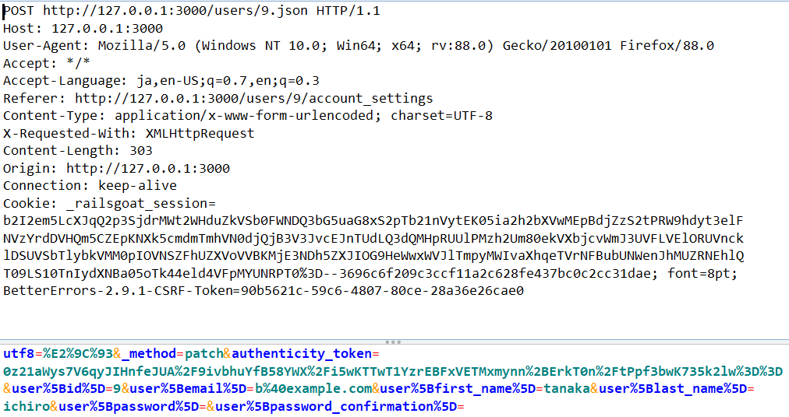
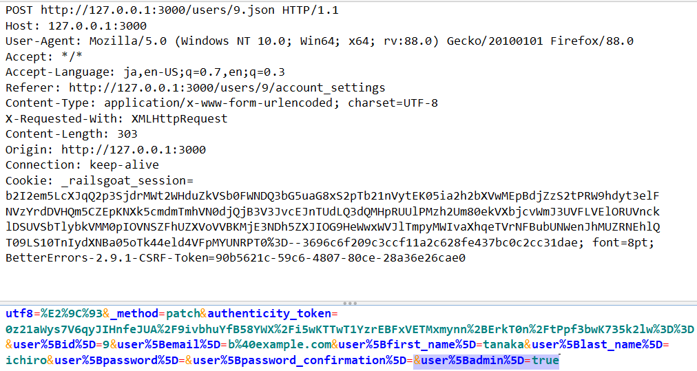

# 4.10.3 Test Integrity Checks - Mass Assignment

## 概要

Rails には Mass Assignment による不正なデータ改ざんを防ぐために、Strong Parameters という仕組みが導入されています。開発者は Strong Parameters を適切に使用することで、ユーザが変更可能な Active Model の属性を制限することができます。

しかし Strong Parameters の設定が不適切だと、依然としてデータ改ざんに対して脆弱な状態になってしまいます。

このテストでは Strong Parameters が適切に設定されていることを確認し、不正なデータ改ざんから保護されているかを検証します。

## 脆弱性の原理

Mass Assignment はデータベースのレコードをハッシュから作成したり更新したりする機能です。

```ruby
# controllers/users_controller.rb
def create
  @user = User.new(params[:user])
  @user.save
end
```

一見便利な機能に見えますが、これには開発者が意図しないデータを作成・更新される危険性もあります。例えば、もし User モデルに `admin` フラグという属性があった場合、だれでも管理者ユーザを作成できてしまいます。

そのような攻撃を防ぐため Rails では Strong Parameters という仕組みが導入され、開発者はユーザが作成・更新可能な属性を明示的に設定しなければ Mass Assignment できないように制限されています。

### Strong Parameters

Strong Parameters を使用することで、ユーザがフォームに入力したデータのみ登録・更新できるようになります。

このような User ビュー、コントローラ、スキーマがあるとします。

```ruby
# views/users/new.html.erb
<%= form_for @user do |f| %>
  <%= f.text_field :name, {:placeholder => "Name"} %>
  <%= f.text_field :age, {:placeholder => "Age"} %>
  <%= f.submit "Submit" %>
```

```ruby
# controllers/users_controller.rb
def create
  @user = User.new(user_params)
  @user.save
end

def update
  @user = User.find(params[:id])
  @user.update(user_params)
end

def user_params
  params
    .require(:user)
    .permit(:name, :age)
end
```

```ruby
# db/schema.rb
create_table "users", force: :cascade do |t|
  t.string "email"
  t.string "password"
  t.boolean "admin"
  t.string "name"
  t.integer "age"
  t.datetime "created_at"
  t.datetime "updated_at"
end
```

`user_params` メソッドが User の登録・更新に使用する Strong Parameters です。開発者はユーザに対して name と age の変更を許可しています。言い換えると emai, password, admin の変更を禁止していることになります。

開発者はすべての create や update に対してアプリケーションの仕様に基づいた Strong Parameters を設定する必要があります。この設定に誤まりがあった場合、悪意あるユーザからのデータ改ざんを許すことになります。

例えば次のように admin フラグを permit リストに入れてしまった場合、攻撃者はリクエストに `user[admin]=true` を追加することで自分自身を管理者に権限昇格させることができてしまいます。

```ruby
# users_controller.rb
def user_params
  params
    .require(:user)
    .permit(:name, :age, :admin)
end
```

## 静的テスト

コントローラのソースコードで Strong Parameters を使用している箇所をレビューし、許可されている属性が最小限になっていることを確認します。

Strong Parameters を使用している箇所はコントローラを `.permit(` で検索すると見つけやすいでしょう。



### 脆弱なコードの例

全ての属性を許可：これは Mass Assignment を許可する危険な設定です。

```ruby
params.require(:user).permit!
```

不要なパラメータを許可

```ruby
params.require(:user).permit(:email, :admin, :first_name, :last_name)
```

### 安全なコードの例

必要最小限の属性のみ許可

```ruby
params.require(:user).permit(:email, :first_name, :last_name)
```

ユーザの権限によって許可する属性を切り替え

```ruby
params.require(:user).permit(:email, :first_name, :last_name, :admin) if user.admin
```

### 検討事項

- 登録時のみ設定可能な属性がある場合（例えば生年月日）、create と update とでは異なる Strong Parameters が使われているはず

## 動的テスト

Create, Update リクエストのパラメータを書き換え、改ざんしたいパラメータを付与して送信します。

下図は Railsgoat の Account settings 画面 `http://127.0.0.1:3000/users/9/account_settings` です。


元のリクエスト



改ざん後のリクエスト

`&user%5Badmin%5D=true` を追加します。



改ざんに成功した場合、脆弱であると判断します。