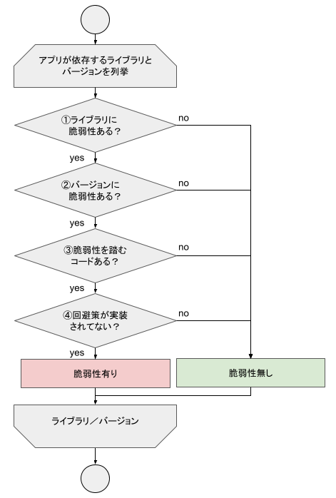

# ソフトウェアコンポジション解析 (SCA)：ライブラリの脆弱性

どんなに注意深くソースコードを書いたとしても、脆弱性ゼロのWebアプリケーションを作ることはできません。なぜなら脆弱性はアプリケーションを動かすためのライブラリやミドルウェアにも存在しうるからです。

Rails アプリケーションも多くの Gem や Javascript ライブラリを使って開発します。ソースコードに問題がなくても Gem に脆弱性があれば Web アプリケーションは危険にさらされることになります。

そのため、アプリケーションが依存する全てライブラリの脆弱性も調査する必要があります。これをソフトウェアコンポジション解析 (Software Composition Analysis, SCA) と言います。

本章ではツールを使ってライブラリに存在する既知の脆弱性を発見し、その脆弱性のプロダクトに対する影響の有無を調査します。

- Gem の脆弱性
  - bundler-audit を使って Gem の脆弱性を検出する
  - Ruby on Rails: Security グループを参照し、脆弱性のプロダクトへの影響を調査する
- Javascript ライブラリの脆弱性
  - Retire.js を使って Javascript ライブラリの脆弱性を検出する
  - 各種情報源を参照し、脆弱性のプロダクトへの影響を調査する

## ソフトウェアコンポジション解析による脆弱性検出の流れ

ソフトウェアコンポジション解析でプロダクトに存在する脆弱性を検出するには、アプリケーションが依存するライブラリとバージョンを列挙したあと、次の4ステップを確認します。

1. ライブラリに脆弱性があるか
2. バージョンに脆弱性があるか
3. 脆弱性を踏むコードがあるか
4. 回避策が実装されているか

本章で紹介する bundler-audit と Retire.js は、ライブラリとバージョンに存在する脆弱性を列挙(①と②)してくれますが、プロダクトがその脆弱性の影響を受けるか否かを判断(③と④)はしてくれません。

セキュリティテストの目的によっては、バージョンチェック（①と②）のみ実施して古いライブラリのバージョンアップを促すだけで十分な場合もあれば、脆弱性の影響調査（③と④）も実施してバージョンアップの緊急度も含めて情報提供する方が良い場合もあります。目的に合った範囲を選びましょう。

### 影響調査の必要性

bundler-audit が脆弱性を報告したからといって、必ずしもプロダクトが危険な状態であるとは限りません。ライブラリに脆弱性が存在したとしても、当該機能を使っていなければ影響は受けないからです。

脆弱性の影響を受けないにもかかわらず、今すぐライブラリをバージョンアップしろ！ASAP！と言うのはあまり望ましくはありません。

このような事態を避けるために、脆弱性のプロダクトへの影響を調査し、バージョンアップの緊急度や優先度を判断する情報を可能な限り提供できるようにします。

### 影響調査の手法

影響調査は静的・動的、両方の手法で実施可能です。

- 静的手法：当該機能が使用されているかをソースコードから確認する
- 動的手法：Webアプリに疑似攻撃を仕掛けて確認する

ライブラリがアプリケーションに直接依存している場合は静的手法が確認しやすいですが、間接的に依存している場合は動的手法のほうが容易になる場合もあります。

本章では静的手法で影響調査します。動的手法は動的アプリケーションセキュリティテスト(DAST)の章で扱います。