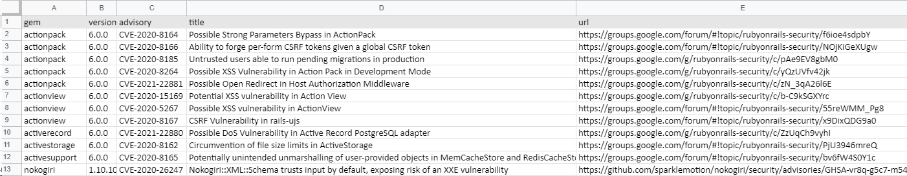
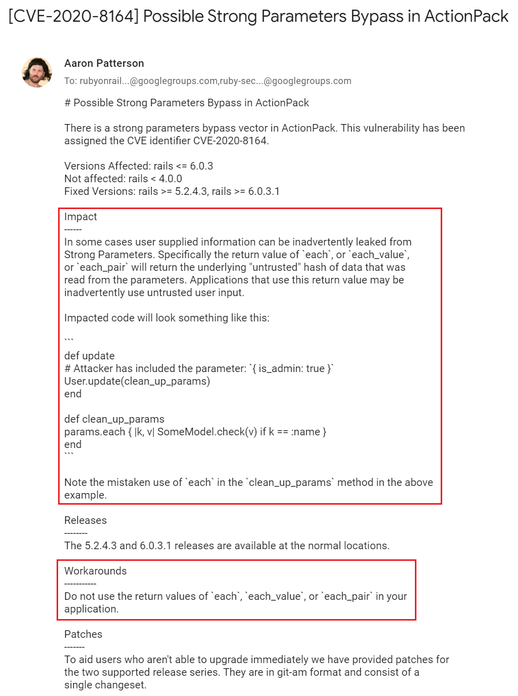
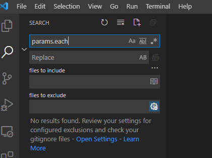
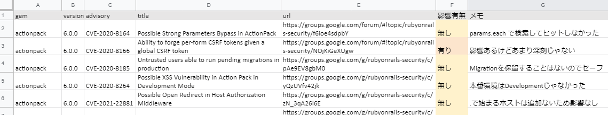

## Gem の脆弱性を検出 (bundler-audit)

Rails アプリケーションは標準でも多数の Gem に依存しています。本節では Gem の SCA ツールである [bundler-audit](https://github.com/rubysec/bundler-audit) を使って脆弱性を検出し、脆弱性一覧表を作成します。

### bundler-audit の使い方

bundler-audit を使うには、Railsアプリケーションのソースコードがあるディレクトリに移動して `bundler-audit` コマンドを実行します。

が、実行する前に `bundler-audit update` で脆弱性データベースを更新しておきましょう。

実行例

```shell
user@sectest:~/railsgoat$ bundler-audit update
Updating ruby-advisory-db ...
From https://github.com/rubysec/ruby-advisory-db
 * branch            master     -> FETCH_HEAD
Already up to date.
Updated ruby-advisory-db
ruby-advisory-db:
  advisories:   485 advisories
  last updated: 2021-03-10 12:29:28 -0800
```

```shell
user@sectest:~/railsgoat$ bundler-audit
Name: actionpack
Version: 6.0.0
CVE: CVE-2020-8164
Criticality: Unknown
URL: https://groups.google.com/forum/#!topic/rubyonrails-security/f6ioe4sdpbY
Title: Possible Strong Parameters Bypass in ActionPack
Solution: upgrade to ~> 5.2.4.3, >= 6.0.3.1

Name: actionpack
Version: 6.0.0
CVE: CVE-2020-8166

...

Vulnerabilities found!
```

`bundler-audit` はこのように結果をプレーンテキスト形式で出力しますが、これでは記録しづらいので、スプレッドシートに貼り付けられる形式に変換しましょう。

`bundler-audit` は結果を CSV で出力することはできませんが、json で出力することはできます。
```
user@sectest:~/railsgoat$ bundler-audit --format json
{
  "version": "0.8.0",
  "created_at": "2021-03-14 15:29:19 +0900",
  "results": [
    {
      "type": "unpatched_gem",
      "gem": {
        "name": "actionpack",
        "version": "6.0.0"
      },
      "advisory": {
...
```

これを `jq` を使って TSV に変換すればスプレッドシートに貼り付けられるようになります。

サンプルスクリプト

```bash
bundle-audit check --format json \
| jq -r '["gem", "version", "advisory", "title", "url"], 
  (.results[] | 
    [
      .gem.name,
      .gem.version,
      .advisory.id,
      .advisory.title,
      .advisory.url
    ] 
  ) 
  | @tsv' \
| clip.exe
```

補足：

* `clip.exe` は出力をクリップボードにコピーする WSL のコマンドで、`pbcopy` や `xclip` みたいなモノです
* TSV に出力する項目は必要に応じて変えてください

bundler-audit の出力を貼り付けたスプレッドシートの例



これで結果を確認しやすくなり、影響調査の記録もしやすくなりました。

### 影響調査の流れ

Gem の脆弱性情報は [Ruby on Rails: Security グループ](https://groups.google.com/g/rubyonrails-security) に良く整理されているのでこれを参照します。`bundler-audit` の出力も、このグループへのリンクがほとんどです。

ここでは [CVE-2020-8164: Possible Strong Parameters Bypass in ActionPack](https://groups.google.com/g/rubyonrails-security/c/f6ioe4sdpbY) を例に、Railsgoatがこの脆弱性の影響を受けるか確認してみましょう。

ページを開くと次のような情報が出てきます。影響調査で特に重要な項目は Impact (影響) と Workaroud (回避策) です。



まずは Impact を読みましょう。

簡単に言うと `params.each` `params.each_value` `params.each_pair` はヤバい。言い換えると `params.each` が Railsgoat に含まれていなければ安全と判断できそうです。

Visual Studio Code でソースコード全体を `params.each` で検索してみましょう。



マッチしませんでした。影響なし！

今回は影響ありませんでしたが、もしマッチした場合は、該当箇所に Workaround があるかを確認します。Workaround には

```
Do not use the return values of `each`, `each_value`, or `each_pair` in your
application.
```

とあるので `params.each` `params.each_value` `params.each_pair` の戻り値を使ってなければセーフ（影響なし）、使ってたらアウト（影響あり）、という判断ができます。

このような流れで、全ての脆弱性の Impact と Workaround を確認します。

影響調査の記録例：


