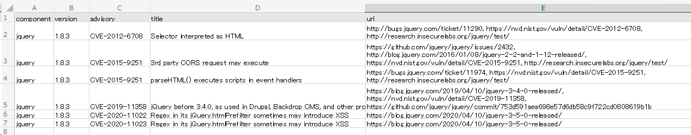

## Javascriptライブラリの脆弱性を検出 (retire.js)

### retire.js

`retire` 
 
コマンド実行例

```
user@sectest:~/railsgoat$ retire
retire.js v2.2.4
Downloading https://raw.githubusercontent.com/RetireJS/retire.js/master/repository/jsrepository.json ...
Downloading https://raw.githubusercontent.com/RetireJS/retire.js/master/repository/npmrepository.json ...
/home/user/railsgoat/app/assets/javascripts/jquery.min.js
 ↳ jquery 1.8.3
jquery 1.8.3 has known vulnerabilities: severity: medium; CVE: CVE-2012-6708, bug: 11290, summary: Selector interpreted as HTML; http://bugs.jquery.com/ticket/11290 https://nvd.nist.gov/vuln/detail/CVE-2012-6708 http://research.insecurelabs.org/jquery/test/ severity: medium; issue: 2432, summary: 3rd party CORS request may execute, CVE: CVE-2015-9251; https://github.com/jquery/jquery/issues/2432 http://blog.jquery.com/2016/01/08/jquery-2-2-and-1-12-released/ https://nvd.nist.gov/vuln/detail/CVE-2015-9251 http://research.insecurelabs.org/jquery/test/
...
```

すごく、見づらいです。。。

### スプレッドシートに貼り付ける

`retire` は `bundler-audit` と同様に、結果をJSONで出力させることができます。`jq` で整形しましょう。

サンプルスクリプト

```bash
retire --outputformat json 2>&1 \
| jq -r '["component", "version", "advisory", "title", "url"], 
  (.data[].results[] | . as $result | .vulnerabilities[] | 
    [
      $result.component,
      $result.version,
      (.identifiers.CVE | join(", ")),
      .identifiers.summary,
      (.info | join(", "))
    ]
  )
  | @tsv' \
| clip.exe
```

* 出力する項目は必要に応じて変えてください
* clip.exe はクリップボードにコピーするWSLのコマンドで、`pbcopy` や `xclip` みたいなモノです

`retire`の出力を貼り付けたスプレッドシートの例



### 脆弱性の精査

ライブラリに脆弱性がある、プロダクトがその脆弱性の影響を受けるか？を確かめる必要がある。これは2-3で説明します。