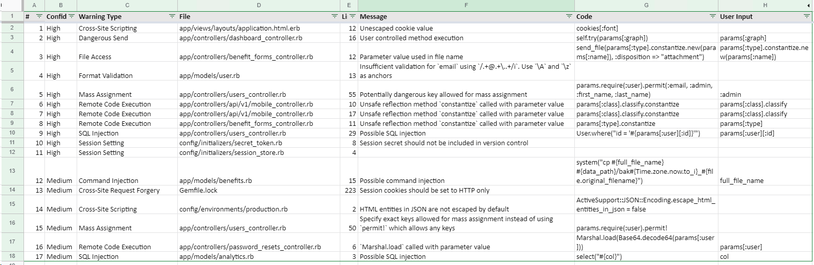
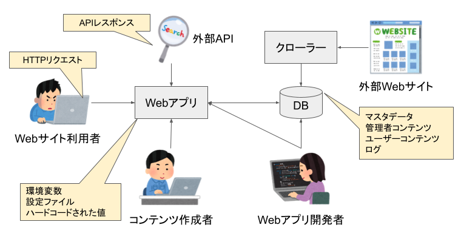
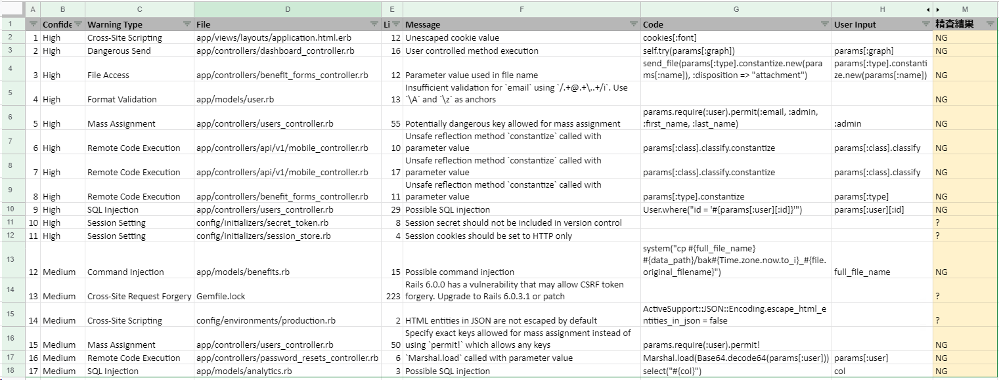
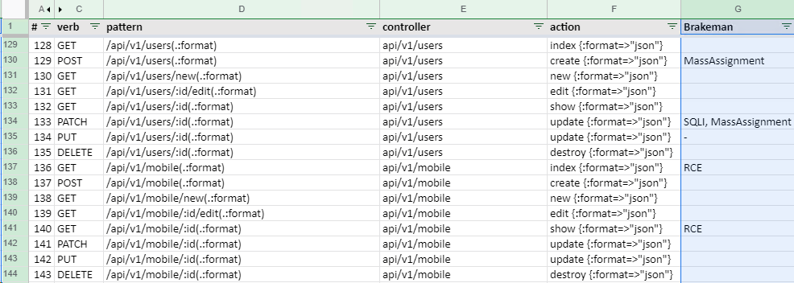

## Rails セキュリティコードレビュー (ツール)

Rails には [Brakeman](https://brakemanscanner.org/)という静的解析ツールがあります。本節では Brakeman を使ってコードの欠陥を検出し、結果を目視で精査します。

Brakemanは脆弱性の疑いがあるコードを発見してくれますが、アラート＝脆弱性というわけではありません。

あくまで「疑わしいコード」なので、その中からホンモノとニセモノを精査しないと、セキュリティテストの報告書には書けません。（書いてもいいですが、クオリティは下がりますよね！）

本節ではBrakemanの使い方と、ニセモノを除外するための考え方を紹介します。

ニセモノを除外していって残ったものがホンモノ。の可能性が高いですが、ホンモノであることを確かめるには、多くの場合、動的セキュリティテストが必要です。動的セキュリティテストは次章で扱います。

### Brakeman の使い方

ソースコードがあるディレクトリに異動して `brakeman -A` コマンドを実行します。 `-A` は追加の検査をしてくれるオプションです。付けて困ることはないと思うので、基本的には `-A` をつけておくとよいと思います。

```shell
user@sectest:~/railsgoat$ brakeman -A
Loading scanner...
Processing application in /home/user/railsgoat
Processing gems...

===略===

== Warnings ==

Confidence: High
Category: Cross-Site Scripting
Check: CrossSiteScripting
Message: Unescaped cookie value
Code: cookies[:font]
File: app/views/layouts/application.html.erb
Line: 12

Confidence: High
Category: Dangerous Send
...

```

`-o` オプションを付けると結果をファイルに出力できます。CSVファイルに出力すればスプレッドシートに貼り付けやすいくて良いですね！

```shell
user@sectest:~/railsgoat$ brakeman -A -o result.csv
===略===
user@sectest:~/railsgoat$ more result.csv
Confidence,Warning Type,File,Line,Message,Code,User Input,Check Name,Warning Code,Fingerprint,Link
High,Cross-Site Scripting,app/views/layouts/application.html.erb,12,Unescaped cookie value,cookies[:font],,CrossSiteScripting,2,febb2
1e45b226bb6bcdc23031091394a3ed80c76357f66b1f348844a7626f4df,https://brakemanscanner.org/docs/warning_types/cross-site_scripting/
...
```

出力されたCSVファイルをスプレッドシートにインポートした例：



このスプレッドシートは精査の記録に役立ちます。

### Brakeman の結果を精査する

Brakemanのアラートはすべてが脆弱性というわけではなく、誤報の場合もあります。特にインジェクション系の脆弱性は誤報が多いです。誤報が多いレポートは役に立たないので精査しましょう。

`Confidence` は誤報度合いの参考にはなりますが、`High` でも誤報のこともあれば、逆に `Weak` でもホンモノのこともあります。アラートが多くてすべてを見切れない場合を除き、すべてのアラートを精査することをお勧めします。

精査は `File` と `Line` が指し示しているコードを参照しながら、パラメータである `Code` と `User Input` が信頼できる値であるかを目視で確認していきます。

#### パラメータが検証されている場合

Brakeman はパラメータが検証されていたりサニタイズされている場合でもアラートを出すことがあります。この場合、アラートは False Positive と判断できます。

ただし、検証やサニタイズの妥当性は確認しておきましょう。もし安全である確信が持てない場合は、動的テストで実効性を確認するのも良いでしょう。

#### パラメータの作成者が信頼できる場合

Webアプリケーションで処理されるパラメータの参照元や作成者は様々です。パラメータの参照元のと作成者例：



パラメータの作成者が信頼できるとき、そのアラートは False Positive と判断できる場合があります。

例えば、Brakemanはクロスサイトスクリプティングのアラートを挙げており、実際に入力値がサニタイズされていない場合であっても、コンテンツ作成者が職務上パラメータにスクリプトを埋め込むことを許可されていれば問題ないでしょう。

ただし、パラメータの作成者が信頼できるからと言って、パラメータの検証やサニタイズが無意味かというとそうでもありません。パラメータ参照元が何らかの脆弱性によってデータを改ざんされることが想定される場合、検証やサニタイズはリスクを緩和します。

### 精査結果の記録

BrakemanのCSVファイルを整形してチェック結果を追記するのが良いと思います。



また、アラートに対応するコントローラ・アクションが分かる場合は、URL一覧にメモをしておくと後のテストがはかどります。



railsgoat はわざと脆弱性に作られたアプリなのでほぼすべてホンモノっぽいです。一部、セキュリティにかかわる設定の不備を指摘しているものもあり、実害に発展しうるか現時点では判断をつけがたいのでとりあえず？としてます。

※このような「実害に発展するかわからないが、セキュリティ上は不適切」を報告するか否かは、セキュリティテストの目的に沿って決めれば良いと思います。