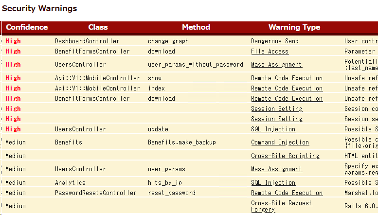
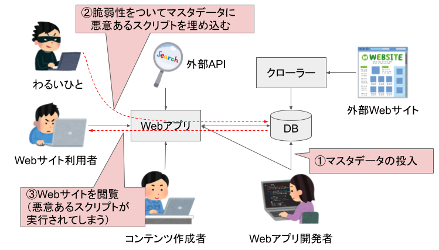

## Brakeman を使ったソースコードの静的解析

Rails には [Brakeman](https://brakemanscanner.org/) というソースコードの静的解析ツールがあります。Brakeman は自動かつ高速にソースコードを検査できるため、セキュリティテストでは重宝します。

railsgoatをBrakemanで解析すると、次のような結果が得られます。



本節では Brakeman を使ってコードの欠陥を検出し、その結果を目視で精査します。

### Brakeman の注意点

Brakeman はとても便利なツールですが、次の3点を認識しておく必要があります。

#### 1. 検出できない脆弱性がある

Brakeman はすべての脆弱性※に対応しているわけではありません。また、対応していても漏れなく検出してくれるわけではありません。Brakeman が何も報告しなかった＝脆弱性ゼロとは思わないでください。

様々な脆弱性を網羅的にテストするには、Brakeman だけでなく、目視によるコードレビューや動的アプリケーションセキュリティテストで補完する必要があります。

※Brakemanが対応している脆弱性の種類は次のページにあります：[Brakeman Warning Types](https://brakemanscanner.org/docs/warning_types/)

#### 2. 検出されたアラートの中には誤報(False Positive)が含まれる

Brakeman が報告するのはあくまで「疑わしいコード」なので、実際は問題がないコードが検出されることもあります。

本当に問題があるコードなのかを判断するために、結果を目視で精査する必要があります。

#### 3. 誤報でなかったとしても、実際に悪用可能かは分からない

Brakeman が検出するのはソースコード上の問題なので、Webアプリケーションとし実行したときにどのような挙動をするかは、実際に動かしてみるまで分かりません。

その問題が悪用可能であるかを確かめるには、動的アプリケーションセキュリティテストが必要です。動的アプリケーションセキュリティテストは次の章で扱います。

### Brakeman の使い方

Brakeman を使うには、Railsアプリケーションのソースコードがあるディレクトリに移動して `brakeman -A` コマンドを実行します。 `-A` は追加の検査をしてくれるオプションです。付けて困ることはないと思うので、基本的には `-A` をつけておいてよいと思います。

brakeman の実行例：

```shell
user@sectest:~/railsgoat$ brakeman -A
Loading scanner...
Processing application in /home/user/railsgoat
Processing gems...

===略===

== Warnings ==

Confidence: High
Category: Cross-Site Scripting
Check: CrossSiteScripting
Message: Unescaped cookie value
Code: cookies[:font]
File: app/views/layouts/application.html.erb
Line: 12

Confidence: High
Category: Dangerous Send
...

```

通常、結果は標準出力に吐き出されますが、`-o` オプションを付けるとファイルに出力できます。`-o filename.html` や `-o filename.csv` のように使います。CSVファイルに出力すればスプレッドシートに貼り付けやすいくて良いですね！

```shell
user@sectest:~/railsgoat$ brakeman -A -o result.csv
===略===
user@sectest:~/railsgoat$ more result.csv
Confidence,Warning Type,File,Line,Message,Code,User Input,Check Name,Warning Code,Fingerprint,Link
High,Cross-Site Scripting,app/views/layouts/application.html.erb,12,Unescaped cookie value,cookies[:font],,CrossSiteScripting,2,febb2
1e45b226bb6bcdc23031091394a3ed80c76357f66b1f348844a7626f4df,https://brakemanscanner.org/docs/warning_types/cross-site_scripting/
...
```

出力されたCSVファイルをスプレッドシートにインポートした例：


このスプレッドシートは精査の記録に役立ちます。

### Brakeman の結果を精査する

Brakemanのアラートはすべてが脆弱性というわけではなく、誤報の場合もあります。特にインジェクション系の脆弱性は誤報が多いです。誤報が多すぎるレポートは役に立たないので精査しましょう。

`Confidence` は誤報度合いの参考にはなりますが、`High` で誤報のこともあれば、逆に `Weak` でもホンモノのこともあります。アラートが多すぎて見切れない場合を除き、すべてのアラートを精査することをお勧めします。

精査は `File` と `Line` が指し示しているソースコードを参照しながら、パラメータである `Code` と `User Input` が安全な値であるかを目視で確認していきます。

安全であるかの判断方法はいろいろあると思いますが、例を次に挙げます。

#### パラメータが検証されている場合

Brakeman はパラメータが検証されていたりサニタイズされている場合でもアラートを出すことがあります。この場合、アラートは False Positive と判断できます。

ただし、検証やサニタイズの妥当性は確認しておきましょう。もし安全である確信が持てない場合は、動的アプリケーションセキュリティテストで有効性を確認するのも良いでしょう。

#### パラメータの作成者が信頼できる場合

パラメータの作成者が信頼できるとき、そのアラートは False Positive と判断できる場合があります。Webアプリケーションで処理されるパラメータの参照元や作成者は様々です。

パラメータの参照元のと作成者例：


例えば Brakeman はクロスサイトスクリプティングのアラートを挙げており、実際に入力値がサニタイズされていない場合であっても、コンテンツ作成者が職務上パラメータにスクリプトを埋め込むことを許可されていれば問題と判断できるでしょう。

ただし、パラメータの作成者が信頼できるからと言って、パラメータの検証やサニタイズが無意味かというとそうでもありません。作成時点ではパラメータが安全な値であっても、使用されるまでの間に改ざんされていた場合、その値は安全とは言えません。


パラメータの参照元データが何らかの脆弱性によって改ざんされることが想定される場合、検証やサニタイズはリスクを緩和します。

### 精査結果の記録

先に出力したCSVファイルを整形し、精査結果を追記するのが良いです。


railsgoat はわざと脆弱性に作られたアプリなのでほぼすべてホンモノっぽいです。一部、セキュリティにかかわる設定不備を指摘しているものもあり、実害に発展しうるか現時点では判断をつけがたいアラートはとりあえず？としてます。

※このような「実害に発展するかわからないが、セキュリティ上は不適切」を報告するか否かは、セキュリティテストの目的に沿って決めれば良いと思います。

アラートに対応するコントローラ・アクションが分かる場合は、URL一覧にメモをしておくと後のテストがはかどります。


### Brakeman まとめ

Brakeman を使ってソースコードにあるセキュリティ上の欠陥を検出しました。

Brakeman は自動かつ高速にソースコードを検査できますが、すべての脆弱性を発見できるわけでもなく、また、誤報もあります。

そのため、Brakeman の結果を目視で精査したり、網羅できていない脆弱性を別のテストで補完することが必要です。