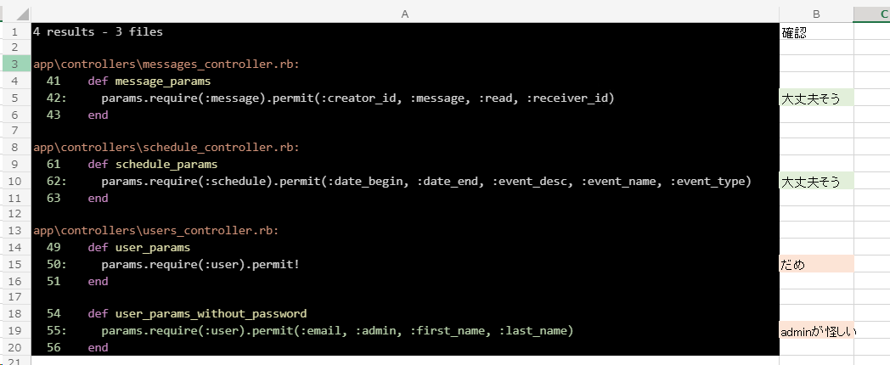
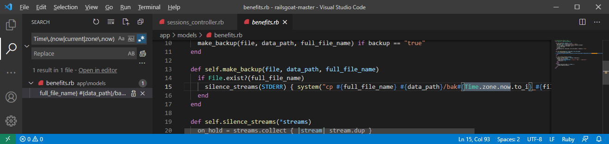

## Rails セキュリティコードレビュー (独自ルール)

Brakemanは脆弱性の発見にとても役立ちますが、Brakemanでは発見できない脆弱性もあります。特にアプリ固有の脆弱性を発見するにはソースコードを目視することも必要です。

なんとなくコードを眺めて脆弱性を発見することもありますが、あらかじめレビューの観点やルールを定めておくと効率よくテストを進められます。

レビューのルールに決まったものはなく、またコードには組織のクセみたいなものもありますので、テストしながら育てていくのが良いです。筆者のオレオレルールをいくつか紹介しますので参考にしてください。

なおセキュリティコードレビューで発見した脆弱性が攻撃可能であるかを確かめるには、動的セキュリティテストが必要である点は留意してください。


### Mass Assignment / 不適切な Strong Parameters の設定

#### 概要

Update 系の処理で使われる Strong Parameters が適切に設定されていない場合、攻撃者によってデータを改ざんされる可能性があります。

あからさまな Mass Assignment の場合は Brakeman でも検出できますが、アラートが出ないパターンもあるので目視でもチェックしておくとよいです。

#### ルール

`.permit` で検索し、permitのパラメータが必要最小限になっていることを確認しましょう。

必要最小とは、「アクションを呼び出すユーザが変更できる属性」であることです。これを厳密に判断するには仕様を理解しておく必要がありますが、ラフさを許容できれば「画面で編集できる項目以外にpermitされている属性があればNG」と判断してもよいと思います。

railsgoat には該当するコードが4か所ありました。


画像は見づらいのでコードを貼り付けておきます。

```ruby
params.require(:message).permit(:creator_id, :message, :read, :receiver_id)
```

1つ目。permitのパラメータはユーザに変更されても問題なさそうな属性です。大丈夫そうですね。

```ruby
params.require(:schedule).permit(:date_begin, :date_end, :event_desc, :event_name, :event_type)
```

2つ目。同様に大丈夫そう。

```ruby
params.require(:user).permit!
```

3つ目。`permit!`はすべての属性をpermitするやつです。高確率でダメです。

```ruby
params.require(:user).permit(:email, :admin, :first_name, :last_name)
```

4つ目。`admin` が怪しいですね。もしこれが管理者権限フラグなら権限昇格できてしまうかもしれません。後でパラメータ仕様を確認するか、動的テストで試しましょう。

ちなみに検索結果の `Open in editor` をクリックすると、該当する行の前後n行も合わせて一気に確認できます。


さらにこれをスプレッドシートに貼り付けると記録も付けられます。



### Insecure Direct Object Reference (IDOR)

#### 概要

Update 系の処理で使われる Strong Parameters が適切に設定されていない場合、攻撃者によってデータを改ざんされる可能性があります。

あからさまな Mass Assignment の場合は Brakeman でも検出できますが、アラートが出ないパターンもあるので目視でもチェックしておくとよいです。

#### ルール

`params\[:.+id\]` で検索し、そのアクションまたはクエリに認可が含まれているかを確認します。


### Cross Site Request Forgery (CSRF) その1

GET リクエストで update 処理をしている場合、そのアクションはCSRF攻撃に(ほぼ間違いなく)脆弱です。

URL一覧で`verb`をGETでフィルタし、該当するコントローラ・アクションのコードを確認していきましょう。アクションの中にリソースの状態を変更する操作があったらアウトです。


※ログアウトにCSRF対策は必要なのか？の議論はここではしません！

なお、↓のようにURL一覧シートに列を追加するとレビューの記録を付けられて良いかもしれません。


### Cross Site Request Forgery (CSRF) その2

RailsではCSRFトークン検証をスキップすることもできます。

トークン検証が本当に不要な場合はいいんですが、必要なのにスキップしていたらダメです。

`skip_before_action :verify_authenticity_token` でコードを検索してみましょう。


railsgoat にはありませんでしたが、検索結果にあった場合、そのコントローラやアクションが、本当にCSRFトーク検証が不要かを確認しましょう。

### レースコンディション

レースコンディションとは、同一のリソースに複数同時に
アクセスした場合に想定外の動作が発生する事象をいいます。

レースコンディションには様々なパターンが有りますが、ここではIDやファイル名を現在時刻をもとに決定している場合に問題が発生するケースを挙げます。

正規表現 `Time\.(now|current|zone\.now)` でコードを検索してみましょう。※現在時刻を取得する方法は他にもあるので、他のパターンも試してみるとよいかもしれません。

railsgoat には1つありました。幅が広すぎてスクリーンショットが取れなかったのでコードを貼り付け。



```ruby 
def self.make_backup(file, data_path, full_file_name)
  if File.exist?(full_file_name)
    silence_streams(STDERR) { system("cp #{full_file_name} #{data_path}/bak#{Time.zone.now.to_i}_#{file.original_filename}") }
  end
end
```

ロジックを観察するに、`original_filename` が同一の値のリクエストが同時に2回以上実行されたら、1回目に作成されたバックアップファイルが2回目に作成されるファイルで上書きされてしまいそうですね。

※コマンドインジェクションもできそう...というのはひとまず置いておく

レースコンディションの問題がありそうなことはわかったので、次にこのメソッドとパラメータがどこから呼ばれるかを辿ってWebサイトの利用者から実行されるか否かを確認します。

辿った結果、BenefitFormsController の upload メソッドに行きつきました。


upload メソッドは利用者から呼ばれるアクションなので、悪用できそう（または運が悪い利用者がバグに遭遇しそう）ですね。

### 不適切なCORS設定

APIを提供している場合、CORS設定が不適切だと情報漏洩につながります。

`Access-Control-Allow-Origin` で検索し、`*` や `request.headers['origin']` が設定されていないか確認します。

railsgoatには無し。

### API(JSON)からの情報漏洩

JSONシリアライズするとき、モデルのオブジェクトをそのままシリアライズしていると不要な属性も

```ruby
def get_user_info
  user = User.find(id: params[:id])
  render :json => user
end
```

シリアライズする属性が制御されていない場合、下記のようなJSONを返すことになり、意図しない情報漏洩の原因となります。

```json
{
    "id": 1,
    "name": "tanaka",
    "email": "tanaka@example.com",
    "password_digest": "$2a$10$N9qo8uLOickgx2ZMRZoMyeIjZAgcfl7p92ldGxad68LJZdL17lhWy"
}
```

正規表現 `render\s+:json` で検索し、パラメータに秘匿情報が入っていないかを確認します。

railsgoatにはなさそうです。


