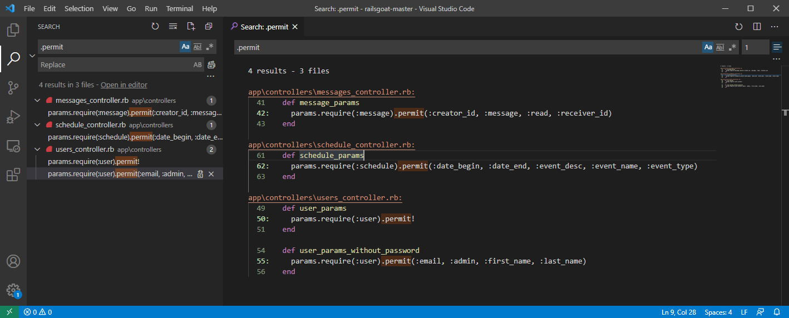
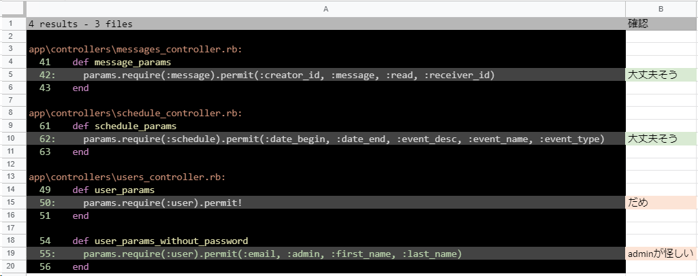
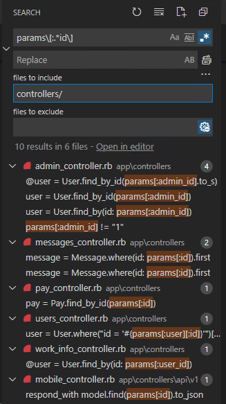
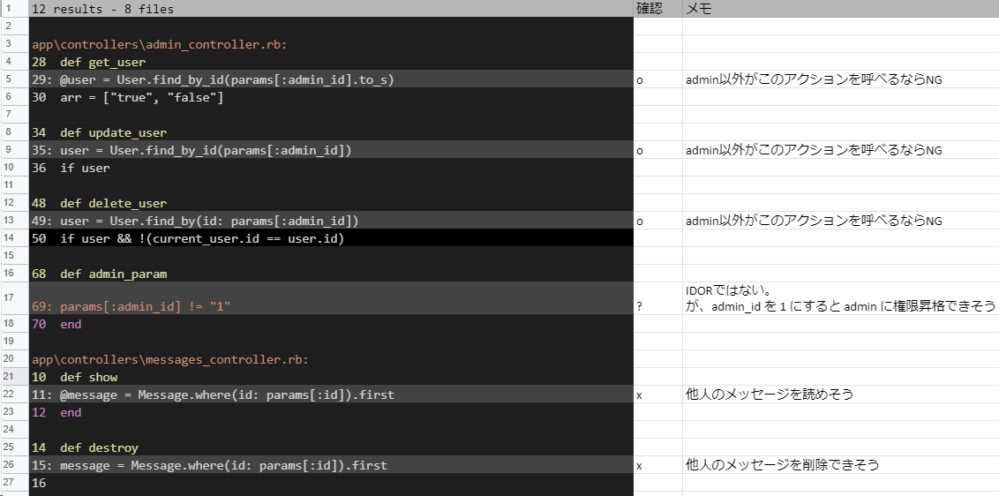
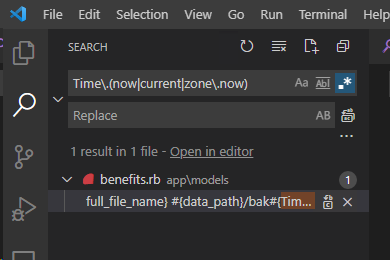
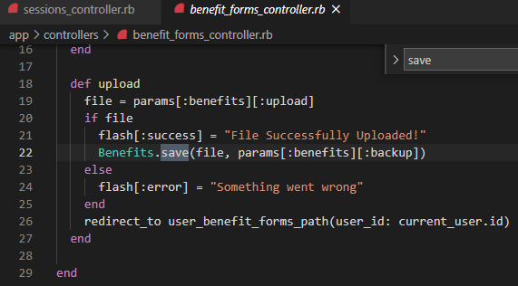
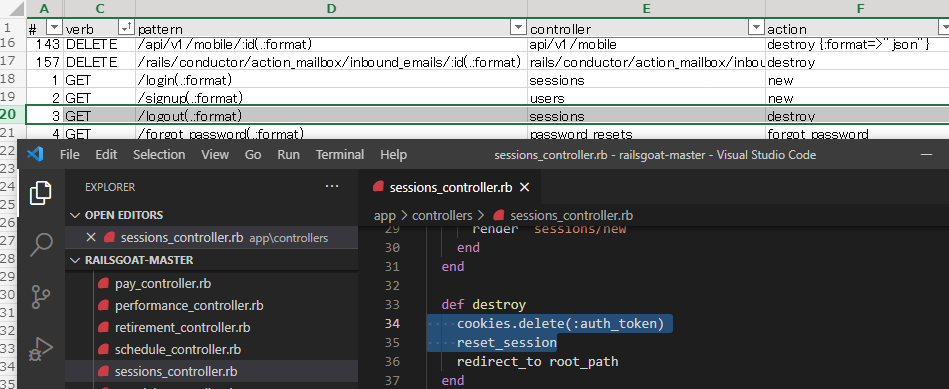
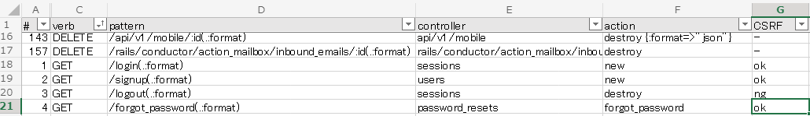
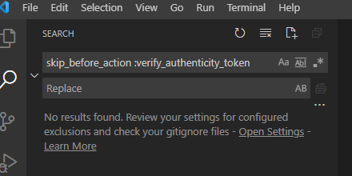
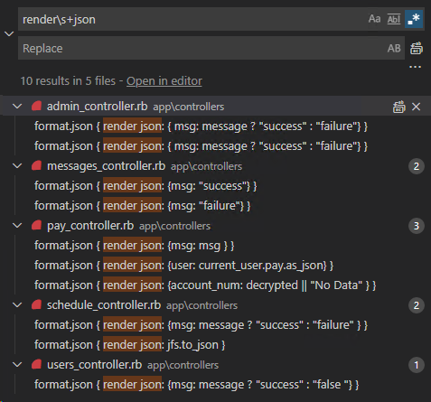

## 目視によるコードレビュー

Brakeman は脆弱性の発見にとても役立ちますが、Brakeman では発見できない脆弱性もあります。特にアプリ固有の脆弱性を発見するにはソースコードを目視でレビューすることも必要です。

コードをなんとなく眺めて脆弱性を発見することもありますが、あらかじめレビューの観点やルールを定めておくと、再現性のあるテストを効率よく実行できるようになります。

レビューのルールに決まったものはなく、またコードには組織や開発チームのクセみたいなものもありますので、テストしながらセキュリティチームの中で育てていくのが良いです。

本節では筆者のオレオレルールを3つ紹介しますので参考にしてください。

### Mass Assignment / 不適切な Strong Parameters の設定

#### 概要

Update 系の処理で使われる Strong Parameters が適切に設定されていない場合、攻撃者によってデータを改ざんされる可能性があります。

あからさまな Mass Assignment は Brakeman でも検出できますが、アラートが出ないパターンもあるので目視でもチェックしておくとよいです。

#### ルール

コントローラー全体を `.permit` で検索し、permit している属性が必要最小になっていることを確認しましょう。

必要最小とは、「アクションを呼び出すユーザが変更できる属性」であることです。これを厳密に判断するにはアプリケーションの仕様を理解しておく必要がありますが、直感的には「Web画面で編集できる項目以外に permit されている属性があればNG」と判断してよいと思います。

#### RailsGoat の場合

RailsGoat には該当するコードが4か所ありました。


1つ目：

```ruby
params.require(:message).permit(:creator_id, :message, :read, :receiver_id)
```

permitのパラメータはユーザに変更されても問題なさそうな属性です。大丈夫そうですね。

補足：このパラメータは `create` メソッドで使われるため問題ないですが、もし `update` で使われる場合はNGかもしれません。更新時に `creator_id` を変更できるのはおかしいですよね。

2つ目：

```ruby
params.require(:schedule).permit(:date_begin, :date_end, :event_desc, :event_name, :event_type)
```

同様に大丈夫そう。

3つ目：

```ruby
params.require(:user).permit!
```

`permit!`はすべての属性をpermitしちゃいます。高確率でダメです。

4つ目：

```ruby
params.require(:user).permit(:email, :admin, :first_name, :last_name)
```

`admin` が非常に怪しいです。もしこれが管理者権限フラグなら権限昇格できてしまうかもしれません。

※ちなみに3つ目と4つ目のパターンはBrakemanでも検出できます

検索結果の `Open in editor` をクリックすると、該当する行の前後n行も合わせて確認できます。



これをスプレッドシートに貼り付けるとレビューの記録を付けることができます。



### 権限昇格 (IDOR)

#### 概要

あるWebサイトの `My Account` をひらいたら URL が `http://example.com/customers/1234` だった時を想像してください。URL の `1234` は自分のユーザIDと推測できます。この `1234` を `1` に変えてアクセスしたらどうなるでしょうか。

もし他の人のアカウント情報が参照できたら、そのサイトはアクセス制御に問題があります。そしてこのような攻撃手法を Insecure Direct Object Reference (IDOR) と言い、権限昇格につながる脆弱性です。参照だけでなく、更新、削除についても同様です。

アクセス制御はアプリケーション固有の仕様となるため、Brakemanで検知することはできません。つまりソースコードから権限昇格の脆弱性を検出するには、目視によるレビューが必要です。

#### ルール

コントローラを正規表現 `params\[:.*id\]` で検索し、リソースにアクセス制御が必要な場合、アクションまたはクエリにアクセス権が含まれているかを確認します。

わかりづらいので具体例を挙げます。ブログ記事(article)を修正できるのは自分だけ、という仕様を想像しつつ次のパターンAとパターンBのコードを観察してください。

A. アクセス権が含まれていないクエリ：

```ruby
def update:
  @article = Articles.find(params[:article_id])
  @article.update!(article_params)
  redirect_to @article
end
```

B. アクセス件が含まれているクエリ：

```ruby
def update:
  @article = @current_user.articles.find(params[:article_id])
  @article.update!(article_params)
  redirect_to @article
end
```

パターンAの場合、`article_id` パラメータを改ざんすれば他人の記事を更新できてしまいます。対してパターンBは他人の `article_id` を使ったところで `@article` はnilとなり更新には失敗するため安全です。

#### RailsGoat の場合

RailsGoat には該当するコードが10か所ありました。



いくつかのパターンがあるので、それぞれ見てみます。

1つ目のパターン：IDOR

```ruby
class MessagesController < ApplicationController
# ...省略...
  def show
    @message = Message.where(id: params[:id]).first
  end
```

IDパラメータを別の番号変えると、他人のメッセージも見れてしまいそうです。NGです。（もし他人のメッセージも見れるという仕様であればOKです）

2つ目のパターン：IDORかつSQLインジェクションっぽい

```ruby
class UsersController < ApplicationController
# ...省略...
  def update
    message = false

    user = User.where("id = '#{params[:user][:id]}'")[0]
```

IDパラメータを別の番号変えると他人のユーザ情報を更新できてしまいそうです。さらにプレースホルダを使ってないので、SQLインジェクションもできそうですね。

このように本来の観点とは異なる問題が見つかることもあります。

3つ目のパターン：IDORっぽいけど違う

```ruby
class AdminController < ApplicationController
# ...省略...
  def get_user
    @user = User.find_by_id(params[:admin_id].to_s)
    arr = ["true", "false"]
    @admin_select = @user.admin ? arr : arr.reverse
  end
```

一見怪しいですが、問題ないかもしれません。AdminControlerという名前から、このアクションは管理機能に見えます。管理者はすべてのユーザ情報を参照できるという仕様であれば、IDORではありません。

ただしこのアクションが本当に管理者からのみ呼ばれる仕様なのかは確認しましょう。

4つ目のパターン：IDORじゃない別の脆弱性

```ruby
def admin_param
  params[:admin_id] != "1"
end
```

クエリではないため IDOR ではありません。しかしクエリパラメータ `admin_id` が `1` の時を特別に扱っていることから、別の問題がありそうです。

このようにレビュー中に気になったことも記録しておくとよいでしょう。作業記録の例：



#### TIPS

実際のセキュリティテストでも、この例のようにレビュー中気になることが次々と出てくることはよくあります。

すぐに済むならその場で確認しても良いですが、あまり深追いし過ぎると自分が今何をやってるかわからなくなってきます。そのため、確認事項があってもその場ではメモするにとどめておき、実際に確認するのは作業途中のレビューが片付いてからにしたほうが良いです。

### レースコンディション

#### 概要

レースコンディションとは、同一のリソースに同時にアクセスした場合に想定外の動作が発生する事象をいいます。

レースコンディションには様々なパターンが有りますが、ここでは現在時刻をもとにIDやファイル名を決定している場合に問題が発生するケースを挙げます。

#### ルール

ソースコード全体を正規表現 `Time\.(now|current|zone\.now)` で検索し、IDやファイル名などを現在時刻だけで作成している場合、NGと判断します。

#### RailsGoat の場合

RailsGoat には1つありました。



```ruby 
def self.make_backup(file, data_path, full_file_name)
  if File.exist?(full_file_name)
    silence_streams(STDERR) { system("cp #{full_file_name} #{data_path}/bak#{Time.zone.now.to_i}_#{file.original_filename}") }
  end
end
```

現在時刻と `original_filename` を組み合わせたファイル名でバックアップを作成しているようです。可能性は低いですが、`original_filename` が同一のリクエストが同時に2回以上実行されたら、1回目に作成されたバックアップファイルが2回目以降に作成されるバックアップファイルで上書きされてしまいそうです。

次にこのメソッドがどこから呼ばれるかを突き止めます。`make_backup` メソッドを呼出してるメソッドを呼出してるメソッド...と辿った結果、`BenefitFormsController` の `upload` メソッドに行きつきました。



`upload` はWebサイトの利用者から呼ばれるアクションなので、顕在化する可能性があると判断できます。

### Cross Site Request Forgery (CSRF) その1

TBW

GET リクエストで update 処理をしている場合、そのアクションはCSRF攻撃に(ほぼ間違いなく)脆弱です。

URL一覧で`verb`をGETでフィルタし、該当するコントローラ・アクションのコードを確認していきましょう。アクションの中にリソースの状態を変更する操作があったらアウトです。



※ログアウトにCSRF対策は必要なのか？の議論はここではしません！

なお、↓のようにURL一覧シートに列を追加するとレビューの記録を付けられて良いかもしれません。



### Cross Site Request Forgery (CSRF) その2

TBW

RailsではCSRFトークン検証をスキップすることもできます。

トークン検証が本当に不要な場合はいいんですが、必要なのにスキップしていたらダメです。

`skip_before_action :verify_authenticity_token` でコードを検索してみましょう。



railsgoat にはありませんでしたが、検索結果にあった場合、そのコントローラやアクションが、本当にCSRFトーク検証が不要かを確認しましょう。

### 不適切なCORS設定

APIを提供している場合、CORS設定が不適切だと情報漏洩につながります。

`Access-Control-Allow-Origin` で検索し、`*` や `request.headers['origin']` が設定されていないか確認します。

railsgoatには無し。

### API(JSON)からの情報漏洩

TBW

シリアライズする属性が制御されていない場合、下記のようなJSONを返すことになり、意図しない情報漏洩の原因となります。

```ruby
def get_user_info
  user = User.find(id: params[:id])
  render :json => user
end
```

```json
{
    "id": 1,
    "name": "tanaka",
    "email": "tanaka@example.com",
    "password_digest": "$2a$10$N9qo8uLOickgx2ZMRZoMyeIjZAgcfl7p92ldGxad68LJZdL17lhWy"
}
```

正規表現 `render\s+:json` で検索し、パラメータに秘匿情報が入っていないかを確認します。

railsgoatにはなさそうです。



### コードレビューのまとめ

TBW

独自のルールに基づいたコードレビューの例を3つ挙げました。

1. `.permit` で検索して、不適切な Strong Parameters 設定を発見する
2. `params\[:.*id\]` で検索し、権限昇格の問題を発見する
3. `Time\.(now|current|zone\.now)`で検索し、ID重複によるレースコンディションを発見する

検索キーワードには改善の余地がありますし、上記以外にもいろいろなルールが考えられますので、セキュリティチームでレビュールールを育てていくとよいです。

今回は予めルールを定めたうえでレビューしましたが、ルールは無くても勘や思い付きに頼って脆弱性を探索することもできます。（未知の脆弱性を発見するには探索的なテストも必要です）
