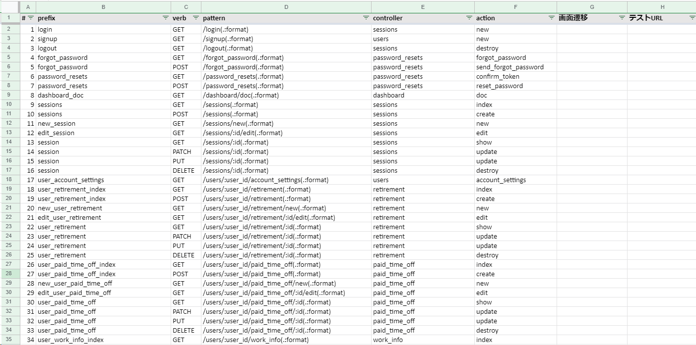

## 動的アプリケーションセキュリティテストの準備

動的アプリケーションセキュリティテストには実環境へのアクセスが必要なため、

- テストツールのセットアップ
- テスト環境の準備
- URL一覧
- ドキュメント

### 使用するツールのセットアップ

下記ツールを使用するため、各サイトを参照しセットアップを済ませておきましょう。

- [OWASP ZAP](https://www.zaproxy.org/)
- [sqlmap](http://sqlmap.org/)

### 情報収集

Webアプリケーションに関するドキュメントがある場合、リンクをまとめておくと良いです。例：


特に初めて触るWebサイトでは迷子になることが多いので、このようなリンク集を作っておくと後々役立ちます。

また、テスト対象にAPIが含まれる場合、APIリクエストを自前で作るのは大変なので開発チーム（QAチームも持ってるかもしれません）からもらっておきましょう。

### テスト環境の準備と関係者への事前通達

動的アプリケーションセキュリティテストでは実環境に疑似攻撃を仕掛けるため、次のようなリスクがあります。

- 一時的に負荷がかかり、応答が遅くなる
- 大量のゴミデータが作成される
- エラー通知が大量に発生する
- データが破壊される

そのためテストは原則、検証環境で実施します。検証環境は本番環境と同等の構成であることが望ましいですが、そうでない 場合は差異を把握しておきましょう

また、可能であれば事前に次のような対応をしておくとよいです。

- 一時的にエラー通知を切っておく（戻し忘れないように！）
- データベースをバックアップしておく

ついでにWebサイトの利用にログインが必要な場合、IDとパスワードも準備しておきましょう。（IDは複数あると便利です）

<!-- 
#### TIPS:検証環境が無い場合は？

検証環境が無い場合、下記のような選択肢があります。

1. 検証環境を作る
2. ソフトウェアコンポジション解析と静的アプリケーションテストだけやる
3. ローカル端末で動かしてテストする
4. 本番環境が壊れるリスクを受容してやる

1. 本番環境が壊れたり一時的にサービス停止しても問題ないというなら動的アプリケーションセキュリティテストをしても良いですが、検証環境を構築してから動的アプリケーションテストを実施するほうが安全です。

3. どうしても動的テストしたいなら。ただし本番環境との差異には注意。WAFやurl rewriteとか。あと外部APIと連携してる箇所はテストできなかったり。
4．やめとけまじで

-->

### URL一覧の作成

URL一覧は動的アプリケーションセキュリティテストの必須アイテムです。URLの数からおおよその工数見積もりができるとともに、テストの記録にも必要です。

Rails には `rails routes` というルーティング一覧を出力してくれるコマンドがあります。コマンドの実行には Rails の実行環境が必要なので、環境構築がめんどくさい場合は開発チームにコマンドを実行してもらっても良いと思います。

```
$ rails routes RAILS_ENV=production
                                Prefix Verb   URI Pattern                                                                              Controller#Action
                                 login GET    /login(.:format)                                                                         sessions#new
                                signup GET    /signup(.:format)                                                                        users#new
                                logout GET    /logout(.:format)                                                                        sessions#destroy
```

すごく、見づらいです。。。というのも、`rails routes` はプレーンテキストで見やすいように整形して出力するためです。


テキストエディタで見ると見やすい気もしますが、テストには使いづらいので TSV に変換しましょう。変換スクリプトの例：

```shell
$ rails routes RAILS_ENV=production | ruby -e 'header = gets
li_prefix = header.index("Verb")
li_verb = header.index("URI Pattern")
li_pattern = header.index("Controller#Action")
print "#\tprefix\tverb\tpattern\tcontroller\taction\t画面遷移\tテストURL\n"
i = 1
prefix_current = ""
while line = gets
  prefix = line[0, li_prefix].strip
  prefix = prefix_current if prefix.length == 0
  prefix_current = prefix
  verb = line[li_prefix, li_verb - li_prefix].strip
  pattern = line[li_verb, li_pattern - li_verb].strip
  cont_and_action = line[li_pattern, line.length - li_pattern].strip
  controller = cont_and_action.split("#")[0]
  action = cont_and_action.split("#")[1]
  print "#{i}\t#{prefix}\t#{verb}\t#{pattern}\t#{controller}\t#{action}\n"
  i += 1
end' | clip.exe
```

※`clip.exe` はクリップボードにコピーするWSLのコマンドで、`pbcopy` や `xclip` みたいなモノです

スプレッドシートに貼り付けるとこんな感じになります。



ルーティングにはURLだけでなくコントローラ・アクションも含まれるので、Web画面と画面に対応するソースコードの両方を見比べながらテストできます。

※セキュリティベンダが提供する脆弱性診断サービスはブラックボックステストとして実施することが多いですが、ソースコードにアクセスできる場合はブラックボックス＋ホワイトボックスのハイブリットの方が漏れなく・効率良くテストできます。

なお、さりげなく`画面遷移`と`テストURL`という列を追加してますが、これについては次に説明します。

### 画面遷移の確認と存在するURLの確認


<!-- 
#### TIPS

テストに使える工数が少なく、画面遷移やテストURLを埋められない場合、`pattern` から機械的にURLを作成することもできます。

漏れる可能性はあるけど、効率は良いです。
-->