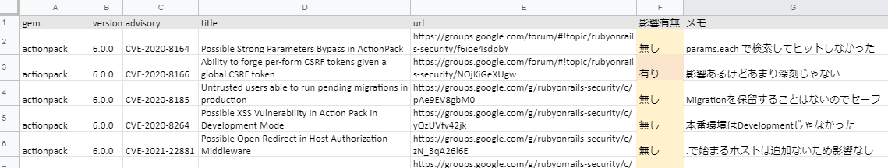

# 脆弱性が報告されているGemの使用

## 概要

どんなに注意深くソースコードを書いたとしても、脆弱性ゼロのWebアプリケーションを作ることはできません。なぜなら脆弱性はアプリケーションを動かすためのライブラリやミドルウェアにも存在しうるからです。

Rails アプリケーションも多くの Gem や Javascript ライブラリを使って開発します。自分達が書いたソースコードに問題がなくても Gem に脆弱性があればアプリケーションは危険にさらされることになります。

このテストでは、ソフトウェアコンポジション解析 (Software Composition Analysis, SCA) により Gem に存在する既知の脆弱性を発見し、その脆弱性のアプリケーションに対する影響の有無を検証します。

## ソフトウェアコンポジション解析

Gem の SCA ツールである [bundler-audit](https://github.com/rubysec/bundler-audit) を使います。bundler-audit は `Gemfile.lock` ファイルに記載されている Gem とそのバージョンの情報をもとに既知の脆弱性をリストアップしてくれます。

### bundler-audit

bundler-audit は gem でインストールできます。

```bash
$ gem install bundler-audit
```

bundler-audit を使う前に、脆弱性データベースをアップデートしておきます。

```bash
$ bundle-audit update
```

rails アプリのディレクトリで `bundle-audit` を実行すると、Gem の脆弱性をリストアップしてくれます。

脆弱性がある場合、次のような結果になります。

```bash
~/railsgoat$ bundle-audit
Name: actionpack
Version: 6.0.0
CVE: CVE-2020-8164
Criticality: Unknown
URL: https://groups.google.com/forum/#!topic/rubyonrails-security/f6ioe4sdpbY
Title: Possible Strong Parameters Bypass in ActionPack
Solution: upgrade to ~> 5.2.4.3, >= 6.0.3.1

Name: actionpack
Version: 6.0.0
CVE: CVE-2020-8166
Criticality: Unknown
URL: https://groups.google.com/forum/#!topic/rubyonrails-security/NOjKiGeXUgw
Title: Ability to forge per-form CSRF tokens given a global CSRF token
Solution: upgrade to ~> 5.2.4.3, >= 6.0.3.1

...
```

脆弱性がない場合、次のような結果になります。

```bash
$ bundle-audit
No vulnerabilities found
```

### 脆弱性一覧をスプレッドシートに出す

`bundler-audit` はプレーンテキスト形式で出力しますが、これでは記録しづらいのでスプレッドシートに貼り付けられる形式に変換すると良いです。

`bundler-audit` は結果を CSV で出力することはできませんが、json で出力することはできます。

```bash
~/railsgoat$ bundler-audit --format json
{
  "version": "0.8.0",
  "created_at": "2021-03-14 15:29:19 +0900",
  "results": [
    {
      "type": "unpatched_gem",
      "gem": {
        "name": "actionpack",
        "version": "6.0.0"
      },
      "advisory": {
...
```

これを `jq` を使って TSV に変換すればスプレッドシートに貼り付けられるようになります。

サンプルスクリプト

```bash
$ bundle-audit check --format json \
| jq -r '["gem", "version", "advisory", "title", "url"], 
  (.results[] | 
    [
      .gem.name,
      .gem.version,
      .advisory.id,
      .advisory.title,
      .advisory.url
    ] 
  ) 
  | @tsv' \
| clip.exe
```

補足：

* `clip.exe` は出力をクリップボードにコピーする WSL のコマンドで、`pbcopy` や `xclip` みたいなモノです
* TSV に出力する項目は必要に応じて変えてください

bundler-audit の出力を貼り付けたスプレッドシートの例


これで結果を確認しやすくなり、影響調査の記録もしやすくなりました。

## 影響調査

bundler-audit が脆弱性を報告したからといって、アプリケーションが必ずしも危険な状態であるとは限りません。ライブラリに脆弱性が存在したとしても、当該機能を使っていなければ影響は受けないからです。

脆弱性が存在する Gem のバージョンアップの緊急度や優先度を判断するには、脆弱性のアプリケーションへの影響を調査する必要があります。脆弱性情報は [Ruby on Rails: Security グループ](https://groups.google.com/g/rubyonrails-security) を参照すると良いでしょう。

### Railsgoatでの影響調査の例

ここでは [CVE-2020-8164: Possible Strong Parameters Bypass in ActionPack](https://groups.google.com/g/rubyonrails-security/c/f6ioe4sdpbY) を例に、Railsgoatがこの脆弱性の影響を受けるか確認します。

ページを開くと次のような情報が出てきます。影響調査で特に重要な項目は Impact (影響) と Workaroud (回避策) です。


まずは Impact を読むと `params.each` `params.each_value` `params.each_pair` の戻り値を使うのはヤバい、ということを言ってます。

言い換えると `params.each` がソースコードに含まれていなければ安全と判断できそうです。Visual Studio Code でソースコード全体を `params.each` で検索してみましょう。


マッチしませんでしたので、影響なしと判断できます。

今回は影響ありませんでしたが、もし該当する箇所があった場合には Workaround があるかを確認します。Workaround には

```
Do not use the return values of `each`, `each_value`, or `each_pair` in your
application.
```

とあるので `params.each` `params.each_value` `params.each_pair` があったとしても、戻り値を使ってなければ影響なしという判断ができます。

このような流れで、全ての脆弱性の Impact と Workaround を確認します。

影響調査の記録例：


