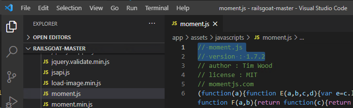
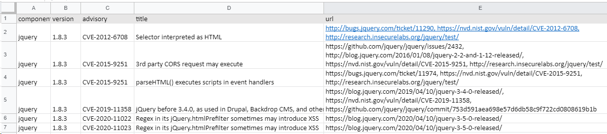

## Javascriptライブラリの脆弱性を検出 (retire.js)

Rails アプリケーションは Gem だけでなく、多くの場合 javascript ライブラリにも依存することになります。本節では Javascript の SCA である [RetireJS](https://github.com/retirejs/retire.js/) を使って脆弱性を検出し、脆弱性一覧表を作成します。

### Retire.js の使い方

RetireJS を使うには、Railsアプリケーションのソースコードがあるディレクトリに移動して `retire` コマンドを実行します。

コマンド実行例

```
user@sectest:~/railsgoat$ retire
retire.js v2.2.4
Downloading https://raw.githubusercontent.com/RetireJS/retire.js/master/repository/jsrepository.json ...
Downloading https://raw.githubusercontent.com/RetireJS/retire.js/master/repository/npmrepository.json ...
/home/user/railsgoat/app/assets/javascripts/jquery.min.js
 ↳ jquery 1.8.3
jquery 1.8.3 has known vulnerabilities: severity: medium; CVE: CVE-2012-6708, bug: 11290, summary: Selector interpreted as HTML; http://bugs.jquery.com/ticket/11290 https://nvd.nist.gov/vuln/detail/CVE-2012-6708 http://research.insecurelabs.org/jquery/test/ severity: medium; issue: 2432, summary: 3rd party CORS request may execute, CVE: CVE-2015-9251; https://github.com/jquery/jquery/issues/2432 http://blog.jquery.com/2016/01/08/jquery-2-2-and-1-12-released/ https://nvd.nist.gov/vuln/detail/CVE-2015-9251 http://research.insecurelabs.org/jquery/test/
...
```

すごく、見づらいです。。。

`retire` は `bundler-audit` と同様に、結果を json で出力させることができます。`jq` で TSV に整形してスプレッドシートに貼り付けましょう。

サンプルスクリプト

```bash
retire -j --outputformat json 2>&1 \
| jq -r '["component", "version", "advisory", "title", "url", "file"], 
  (.data[] | . as $data | .results[] | . as $result | .vulnerabilities[] | 
    [
      $result.component,
      $result.version,
      if .identifiers.CVE then (.identifiers.CVE | join(", ")) else "" end,
      .identifiers.summary,
      (.info | join(", ")),
      $data.file
    ]
  )
  | @tsv' \
| clip.exe
```

* `clip.exe` はクリップボードにコピーするWSLのコマンドで、`pbcopy` や `xclip` みたいなモノです
* TSV に出力する項目は必要に応じて変えてください

`retire` の出力を貼り付けたスプレッドシートの例


### 脆弱性の影響調査

Javascript ライブラリの脆弱性も Gem の脆弱性と同様に、必ずしもプロダクトに影響を与えるわけではないので影響調査をします。

調査には Retire.js が出力したリンク先を参照し、影響を受ける使い方や回避策を探せばよいです。

ただし Javascript ライブラリの脆弱性の情報は、Gem と比較すると整理されていないことが多いため、情報が無かったり見つけにくいこともあります。調査に時間がかかりそうなら、後回しや中断することも検討しましょう。

筆者はまず [NVD (https://nvd.nist.gov/)](https://nvd.nist.gov/) を参照し、次にその他の情報源を当たることが多いです。

### Retire.js の注意点

Retire.js はライブラリやバージョン情報をファイル名やコンテンツ等から抽出しているため、何らかの理由でファイルが変更されてたりすると脆弱性が検出できない場合もあります。

実はこの問題は Railsgoat の例でも発生しています。Railsgoat で使われている moment.js 1.7.2 には [ReDoSの脆弱性](https://github.com/moment/moment/issues/2936) が存在しますが、Retire.js は検出していません。

Retire.js は moment.js の脆弱性を検出しなかった図：





このような見逃しを許容できない場合、Javascriptファイルを目視で確認したり、開発ドキュメントを参照して使用されているライブラリとバージョンを二重でチェックしておくとよいでしょう。
